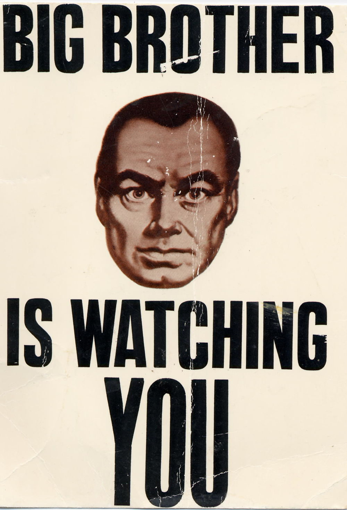

# Swift-Hack-a-thon
An application to document vehicle license plates that are recorded with on-site
cameras, checking against databases of OK'd plate numbers and keeping track of
unknown numbers, warning users in the case of repeat unknowns.

